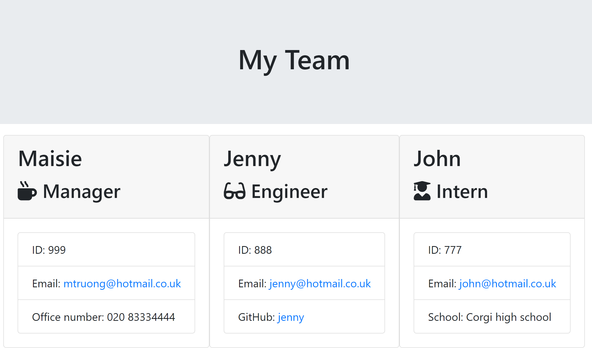

#  Team profile generator
To create a team genator with node.js command line application.

## Description

* This application will take ask the user for information on their team manager
* It will then ask whether the user would like to add an engineer, an intern, or not add any more team members
* If a new engineer or intern is added, information about them will be taken
* Then generate an HTML webpage that displays summaries for each person.

## Installation
Code was built on Visual Studio Code.
Click on following link to view website and github repository.

## Usage
AS A manager
I WANT to generate a webpage that displays my team's basic info
SO THAT I have quick access to their emails and GitHub profiles

## Deployment link:
[Completed challenge] (https://mtruong1995.github.io/team-profile-generator/)

## Repo link:
[Repository] (https://github.com/mtruong1995/team-profile-generator)

## Screenshot:

## Credit

-With help from https://fantastic-pudding.vercel.app/ and Drew from edx Web development course.
-node.js
-bootstrap
